CS 7641 Machine Learning Fall 22
Project Team 18

# Contents
1. [Introduction](#introduction)
    1. [Dataset](#dataset)
2. [Problem Definition](#problem-definition)
3. [Data Collection](#data-collection)
    1. [Data Preprocessing](#data-preprocessing)
4. [Methods](#methods)
    1. [Objective 1](#objective-1-unsupervised)
    2. [Objective 2](#objective-2-supervised)
5. [Results and Discussion](#results-and-discussion)
    1. [Bert Score](#bert-score)
    2. [BLEU](#bleu)
    3. [Self-BLEU](#self-bleu)
    4. [Word Mover's Distance](#word-movers-distancewmd)
    5. [Exploratory Data Analysis](#exploratory-data-analysiseda)
6. [Future Work](#future-work)
7. [References](#references)
8. [Contributions](#contribution-table)

# Introduction 
With the advancement of research in the domain of machine learning, one of the active problems is generating sentences with semantic meaning. A lot of progress has been made in the field of NLP to perform tasks such as text classification, language modeling, and natural language understanding. BERT[[1]](#references) is designed to pre-train deep bidirectional representations from unlabeled text by jointly conditioning on both the left and right context in all layers. As a result, the pre-trained BERT model can be fine-tuned with just one additional output layer to create state-of-the-art models for a wide range of tasks. ULMFiT[[2]](#references) proposed an effective transfer learning method that can be applied to any task in NLP, and introduce techniques that are key for fine-tuning a language model. The paper which introduces AWD-LSTM[[3]](#references), also proposed ways to investigate strategies for regularizing and optimizing LSTM-based models for the specific problem of word-level language modeling - which means building a model which can calculate the joint level probability of what the next word should be, given a sequence of words. The approach and results displayed using AWD-LSTM were our main source of inspiration behind our project. In this project, we plan to leverage and build on top of similar NLP research and fine-tune pre-trained models to generate novel Machine Learning project ideas using transfer learning and classify ML project ideas into different labels. 

### Dataset
The dataset that we plan to use consists of titles of machine learning projects that students at Stanford’s CS229 class submitted over the years 2004 to 2016 [[4]](#references) and CS230 class from 2018 to 2021 [[5]](#references). It includes 4388 ideas, and we further categorize the dataset into 8 classes that we use as ground truth labels for supervised classification.

# Problem definition 
For courses such as Machine Learning, Deep Learning, and Natural Language Processing, one of the major challenges that students face is to come up with a problem statement or project title. We were also in a similar situation and that's when we thought of solving this problem. 
Our objective is twofold:
1. Unsupervised: To generate a novel machine learning project idea, given a corpus of past ML project ideas **(done)**
2. Supervised: To classify a machine learning project idea into different human-labeled categories such as NLP, Vision, Robotics, Health, Finance, Entertainment, Game AI and Generic ML **(next step)**

# Data Collection
For data collection, we decided to use the publicly available datasets consisting of machine learning project ideas and the best one that we found was the collection of titles of projects done by students at Stanford class CS229 and CS230. We created our dataset after extracting only the titles from websites and saved it as an excel file. We did not use CSV file format, since the titles themselves contain ‘commas’ and that corrupts the dataset. The entire corpus of data contains 4388 project ideas/titles. We used 70% of the data for training and 30% as validation data for the unsupervised model training. Once all the titles were extracted, we manually classified the titles into predefined categories such as NLP, Vision, Robotics, Health, Finance, Game AI, Entertainment, and Generic ML, which will be used for training a supervised model. We did this by going through the labels manually or reading the abstracts if the titles were not reflective of the content. 

### Data Preprocessing
After we created the dataset, the next step was to preprocess and clean the data. We process the data to extract only useful information and remove any inconsistencies such as missing values, noisy data, or non-informative features. We remove all the duplicate project titles, by first converting them into lowercase and then scraping off the duplicate values. Given that our dataset consists of project titles, we also eliminated all project ideas with less than 3 words as input. The idea behind this is that project titles with just one or two words, for example, “Bootstrapping”, “Al Mahjong”, “MindMouse”, “rClassifier” etc.,  were not very descriptive and did not seem to add much value to the training dataset. They might even further corrupt the dataset in the case of supervised learning. We further processed the dataset and removed the stopwords such as “and”, “of”, “the” etc. However, in our case, removing these resulted in the project title ideas losing their meanings which were required for our processing since it might have resulted in. For example, input such as “A System for Segmenting Video of Juggling” would become “System Segmenting Video Juggling” and might result in a Garbage in Garbage out situation. Thus, we did not use this as a feature for our dataset. 

# Methods
### Objective 1 (Unsupervised):
Since the dataset that we are working on is relatively small, we have used transfer learning [[6]](#references) to leverage the pre-trained large language model AWD-LSTM. This model is trained on publicly available textual corpus (such as parliamentary records or Wikipedia) and implicitly encodes knowledge of the English language. It is a type of recurrent neural network that has been optimized and trained using techniques like DropConnect for regularization, NT-ASGD for optimizations and many more. We then create a language model fine-tuned for our dataset with the pre-trained weights of AWD-LSTM. We first trained the last layers and left most of the model exactly as it was. To improve our model further, we didn’t unfreeze the whole data but unfreeze one layer at a time starting with the last 2 layers, then the next layer, and finally the entire model for 20 epochs. We then generated 10 ideas and evaluated the results according to our metrics.

### Objective 2 (Supervised):
Our dataset is unlabelled, thus, a preliminary step toward developing supervised learning models would be to tag those titles/ideas manually. We further feed this labeled data to machine learning algorithms such as SVM, Multi-class regression, XGBoost, Naive Bayes Classifier, and random forest to train them. During the testing phase, we input a machine learning project idea to the algorithm, and it classifies it into human-labeled categories.

# Results and Discussion

For POC we first generate only 10 ideas from the model that we trained on the dataset (can be easily extended, since it depends on the user input on how many generated novel ideas the user wants).

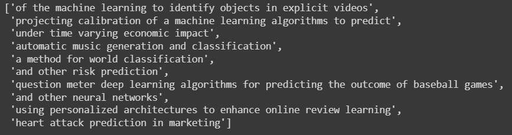         

 <em>Results</em> 

We manually verified the generated results and none of them were from the training dataset, we further use **GLUE-CoLA**[[7]](#references) to judge the grammatical acceptability of a sentence, with the goal of testing their linguistic competence and removing those which do not have semantic meaning, we are left with the following ideas.

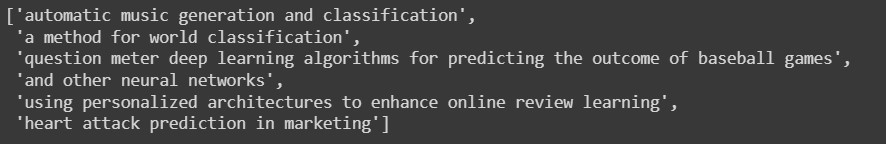

 <em>Grammatically correct results (according to CoLA)</em> 

Although using CoLA makes perfect sense to filter out the ideas before we can score them as ‘Unique’ or ‘Not Unique’, the CoLA metric has its disadvantages:
1. It gives some False Positives, for instance,
    * In the 3rd idea in the above image ***“and other neural networks”***, the sentence in itself is semantically correct but cannot be treated as an ML project Idea.
2. It also gives some False Negatives, for instance,
    * The generated idea ***“projecting calibration of a machine learning algorithms to predict”***, gets removed since it gets a low semantic score from CoLA, but can be treated as an ML Project Idea.

Despite its disadvantages, the analysis done using CoLA can be a starting point for further analysis since we don't want to run any analysis on the sentences which do not semantically make sense.

After this, we make use of algorithms like BERTScore[[9]](#references), BLEU[[10]](#references) - its variants like BLEU-2, BLEU-3, BLEU-4, Self-BLEU[[11]](#references), and Word Mover’s Distance[[12]](#references) to score and analyze the results.

### BERT Score
Uses BERT for calculating the quality of text generated by NLG systems. It captures the semantic aspect by using the contextualized embeddings generated by the BERT model. It calculates Precision, Recall, and F-score according to the following formulae, where *x* is the reference and  *xˆ* is the candidate sentence. 

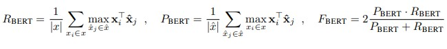

#### How is it Used?
We calculate the R, P, and F value of each candidate(generated) wrt each reference(dataset) sentence, take the maximum of each value, and if any of those values are more than a user-defined threshold (in our case 0.39), then we will tag that generated idea as “Not Unique enough” else it will be tagged as “Unique”.

***(Since it uses BERT for the calculation, it is very slow, and being low on resources we did not run the function, but the code can be seen in the provided jupyter notebook)***

### BLEU
BLEU stands for Bilingual Evaluation Understudy. The metric used in comparing a candidate translation to one or more reference translations. And the output lies in the range of 0-1, where a score closer to 1 indicates good-quality translations. It basically gives out how much similar the generated text is as compared to the reference (training) text.

#### How is it used?
The variants of BLEU used in our project are, BLEU-2, BLEU-3, and BLEU-4 here, each of 2, 3, and 4 represent the precision of the n-gram sequence that is taken into consideration while calculating the BLEU score. We calculate the BLEU-2, BLEU-3, and BLEU-4 scores of each candidate(generated) wrt each reference(dataset) sentence, and if any of those values are more than a user-defined threshold (in our case 0.39), then we will tag that generated idea as “Not unique enough” else it will be tagged as “Unique”.

***(Note, we did not make use of BLEU-1, since we also want to capture the context while calculating the score)***

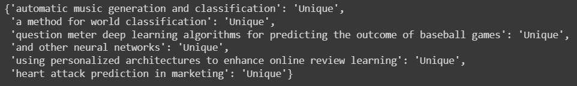

 <em>Unique or Not unique according to BLEU scores</em> 

### Self-BLEU
Self-BLEU is a smart use of the traditional BLEU metric for capturing and quantifying diversity in the generated text. It makes use of BLEU scores and their variants and smaller values mean more diverse generated text.

#### How is it used?
1. Pick a sentence from a set of generated sentences. Calculate the BLEU score between this sentence and all other remaining sentences from the set.
2. Iterate over all the unique sentences, generate BLEU scores for all, and store them in a list (we use BLEU-2, BLEU-3, and BLEU-4).
3. Finally, take the average of the list calculated as a part of step 2.

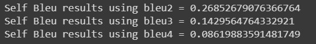

 <em>Diversity in the generated text</em> 

### Word Mover’s Distance(WMD)
It calculates the distance a word takes to move itself to another word in some common hyperspace representation. This method can be used to determine the semantic closeness between the generated and the reference text pieces by calculating the minimum word-word distance it takes to transform a sentence into another sentence. The distance calculated by the WMD gives an idea of how much similar the sentence will be to the reference sentence. The greater the distance, the more dissimilar the candidate sentence is.

#### How is it used?
We calculate the WMD value of each candidate(generated) wrt each reference(dataset) sentence, take the minimum of each value, and if that value is greater than a user-defined threshold (in our case 0.39), then we will tag that generated idea as “Unique” else it will be tagged as “Not unique enough”.

 <em>Unique or Not unique according to BLEU scores</em> 

## Exploratory Data Analysis(EDA)
Exploratory data analysis is the process of generating insights, exploring data, testing hypotheses, checking assumptions and realizing underlying hidden patterns in the data. The dataset has 4388 ML project ideas tagged as one of the - (Entertainment, Health, NLP, Vision, Robotics, Game AI, Finance, Generic ML). Before drawing out the statistics, we preprocess the data. This phase includes removing special characters and stopwords, converting to lowercase, and lemmatization. The class distribution of the dataset is shown below. 

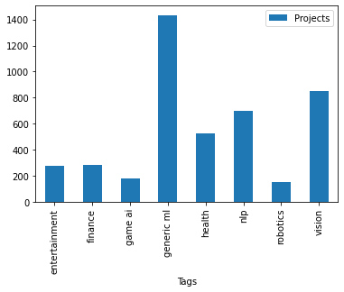

 <em>Class Distribution</em> 

The number of occurrences of a word in a class is calculated and the 30 most frequently occurring words in each class are plotted. But this does not give a good approximation of the relevance of the word to the class and we resort to TF-IDF as a scoring measure. TF is the term frequency which is the ratio of the number of times a particular word occurred in the class to the total number of words in the class. IDF or inverse document frequency is defined as the logarithm of the number of classes divided by the number of classes containing the word. IDF for a word is constant across the data corpus. Thus the IDF identifies the importance of rare words across the whole corpus. The formulae are

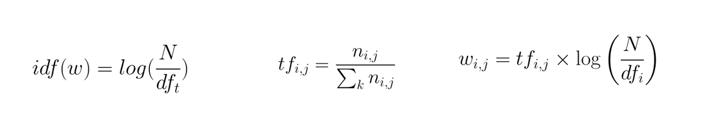

wij = TF_IDF product of ith word with respect to class j.

The following images are the plots for frequent words and highest TF_IDF score. The left plot represents the top 30 most frequent words in the class whereas the right plot represents the top 30 words with the highest TF_IDF score for that class.

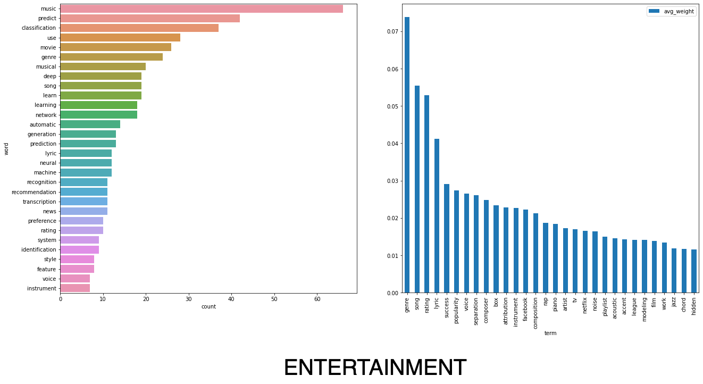

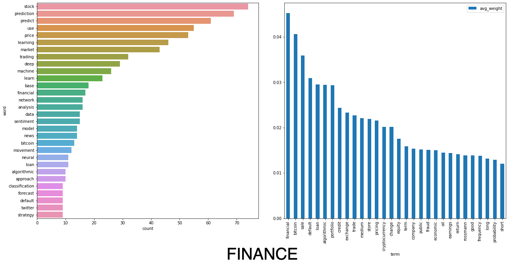

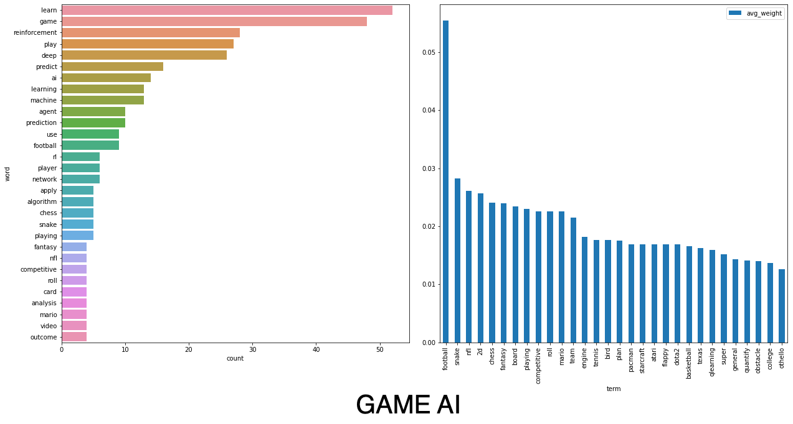

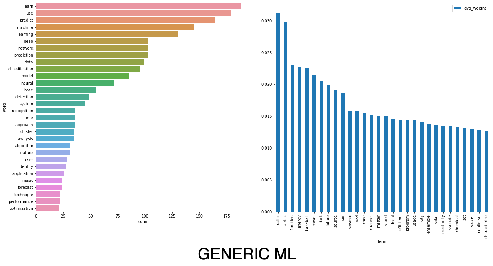

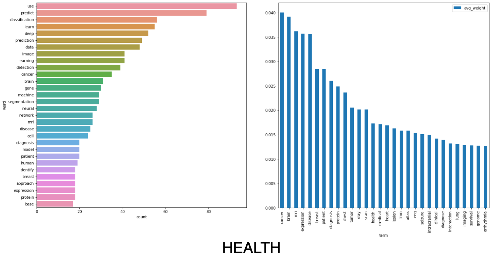

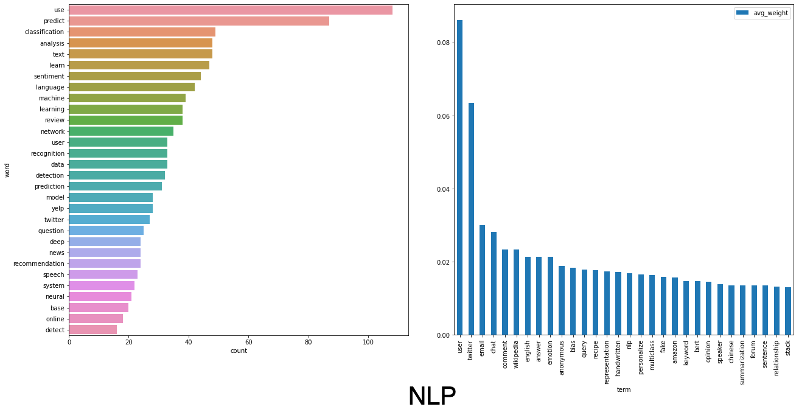

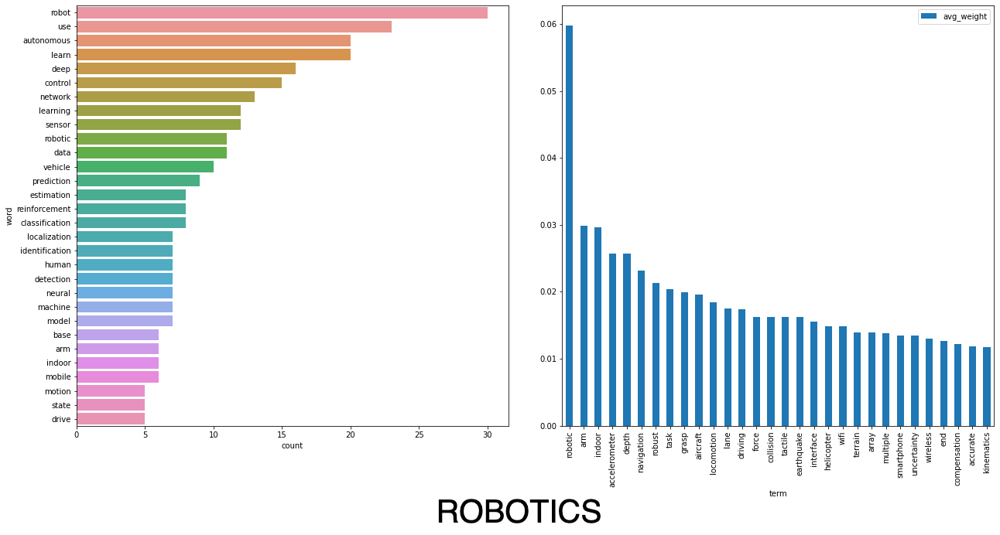

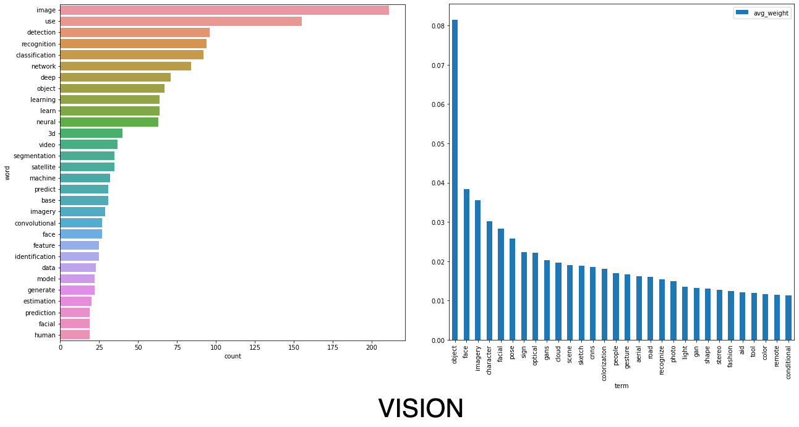

Some words often appear with high frequency in machine learning project titles like ‘classification’, ‘use’, and ‘recognition’. However, these words exist in every class and thus play no significant role in distinguishing between two classes. In other words, they show low variance frequency across classes. This is where TF-IDF comes into play. We need words that appear with high frequency in a class but are also sparsely observed in other classes. In the figure above, we see that for the class ‘Vision’, while ‘use’,’ recognition’, and ‘detection’ have the highest frequency, they do not appear in the top 30 terms with the highest TF-IDF for the class, meaning that they won’t perform well as a feature in the classification task. In the future, we will use a combination of words with the highest TF-IDF for the classification task. 

# Future Work
We generate only 10 results considering this as a proof of concept for our project and since we are low on resources, we plan on generating more results once we get hold of a good GPU. After that, we plan on building a supervised model (which is the 2nd objective of our project) on the tagged data that we have. Given an ML Project Idea, the supervised model will predict the category(ies) to which it belongs to.
We also plan on creating the end-2-end POC where the unsupervised model will generate a new ML project idea and we will feed that to our supervised model which will tag it into the relevant category(ies).

# References

1. [BERT: Pre-training of Deep Bidirectional Transformers for Language Understanding](https://arxiv.org/abs/1810.04805)
2. [Universal Language Model Fine-tuning for Text Classification](https://arxiv.org/abs/1801.06146)
3. [Regularizing and Optimizing LSTM Language Models](https://arxiv.org/abs/1708.02182v1)
4. [Stanford Projects](https://cs229.stanford.edu/projects2004)
5. [Past Projects](http://cs230.stanford.edu/past-projects/)
6. [Transfer Learning for Style-Specific Text Generation](https://nips2018creativity.github.io/doc/Transfer%20Learning%20for%20Style-Specific%20Text%20Generation.pdf)
7. [Glue: A MultiTask Benchmark and Analysis Platform for Natural Language Understanding](https://openreview.net/pdf?id=rJ4km2R5t7)
8. [Evaluation Metrics for Multi-Label Classification](https://medium.datadriveninvestor.com/a-survey-of-evaluation-metrics-for-multilabel-classification-bb16e8cd41cd)
9. [ BERTScore: Evaluating Text Generation with BERT](https://arxiv.org/abs/1904.09675)
10. [BLEU: a Method for Automatic Evaluation of Machine Translation](https://aclanthology.org/P02-1040.pdf)
11. [Texygen: A Benchmarking Platform for Text Generation Models](https://arxiv.org/pdf/1802.01886.pdf)
12. [From Word Embeddings To Document Distances](https://proceedings.mlr.press/v37/kusnerb15.pdf)

# Contribution Table

