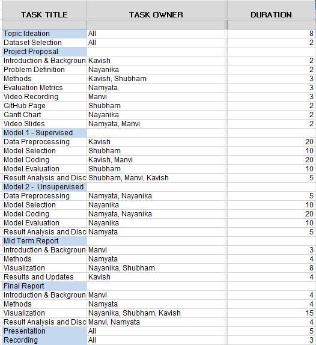

CS 7641 Machine Learning Fall 22
Project Team 18

# Contents
1. [Introduction](#introduction)
    1. [Dataset](#dataset)
2. [Problem Definition](#problem-definition)
3. [Methods](#methods)
    1. [Objective 1](#objective-1-unsupervised)
    2. [Objective 2](#objective-2-supervised)
4. [Results](#results)
    1. [Unsupervised](#unsupervised)
    2. [Supervised](#supervised)
5. [References](#references)
6. [Gantt Chart](#gantt-chart)
7. [Contributions](#contribution-table)
8. [Presentation Video](#presentation-video)

# Introduction 
With the advancement of research in the domain of machine learning, one of the active problems is generating sentences with semantic meaning. A lot of progress has been made in the field of NLP to perform tasks such as text classification, language modeling, and natural language understanding. In this project, we plan to leverage and build on top of similar NLP research to generate novel Machine Learning project ideas using transfer learning and classify ML project ideas into different labels.  

### Dataset
The dataset that we plan to use consists of titles of machine learning projects that students at Stanford’s CS229 class submitted over the years 2004 to 2016 [[1]](#references) and CS230 class from 2018 to 2021 [[2]](#references). It includes ~4200 ideas, each comprising 5-7 words. We further categorize the dataset into ~8 classes that we use as ground truth labels for supervised learning classification. 

# Problem definition 
For courses such as Machine Learning, Deep Learning, and Natural Language Processing, one of the major challenges that students face is to come up with a problem statement or project title. Being in a similar situation ourselves, we thought of solving this problem.  
Our objective is twofold:
1. To generate a novel machine learning project idea, given a corpus of past ML project ideas. (Unsupervised)
2. To classify a machine learning project idea into different categories (NLP, Robotics, Vision, Health, Finance) (Supervised)

# Methods
### Objective 1 (Unsupervised):
Since the dataset that we are working on is relatively small, we aim to use transfer learning [[3]](#references) to leverage pre-trained large language models such as BERT [[4]](#references), AWD-LSTM [[5]](#references), and ULMFit [[6]](#references). These models are trained on publicly available textual corpus (such as parliamentary records or Wikipedia) and implicitly encode knowledge of the English language. We aim to fine-tune these models to learn from our domain-specific dataset. This would, in an unsupervised manner, result in the model generating novel machine learning ideas. 
### Objective 2 (Supervised):
Our dataset is unlabelled, thus, a preliminary step toward developing supervised learning models would be to tag those titles/ideas manually. We further use this labeled dataset to classify an ML project idea into human-labeled categories using algorithms such as SVM, Multi-class regression, XGBoost, Naive Base Classifier, and random forest.

# Results

### Unsupervised

A sentence generated by the model will be evaluated on its similarity score with input data using metrics such as Bleu, Rogue, and semantic correctness using CoLA [[7]](#references) and STS-B [[7]](#references).

### Supervised

We plan to use sklearn metrics to evaluate the classification performance given the ground truth. Since a project idea can be assigned multiple labels we can evaluate metrics such as F1 score, micro, and macro confusion matrix, and hamming loss based on examples (data points) and labels.

# References

1. [Stanford Projects](https://cs229.stanford.edu/projects2016)
2. [Past Projects](http://cs230.stanford.edu/past-projects/)
3. [Transfer Learning for Style-Specific Text Generation](https://nips2018creativity.github.io/doc/Transfer%20Learning%20for%20Style-Specific%20Text%20Generation.pdf)
4. [BERT: Pre-training of Deep Bidirectional Transformers for Language Understanding](https://arxiv.org/abs/1810.04805)
5. [Regularizing and Optimizing LSTM Language Models](https://arxiv.org/abs/1708.02182v1)
6. [Universal Language Model Fine-tuning for Text Classification](https://arxiv.org/abs/1801.06146)
7. [Glue: A MultiTask Benchmark and Analysis Platform for Natural Language Understanding](https://openreview.net/pdf?id=rJ4km2R5t7)
8. [Evaluation Metrics for Multi-Label Classification](https://medium.datadriveninvestor.com/a-survey-of-evaluation-metrics-for-multilabel-classification-bb16e8cd41cd)

# [Gantt Chart](https://docs.google.com/spreadsheets/d/1Ckuu6r8BdbIab1lo3kJkdjhAnlVZ6WLj/edit#gid=422388448)

# Contribution Table

# Presentation Video
