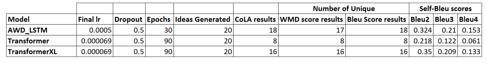

CS 7641 Machine Learning Fall 22
Project Team 18

# Contents
1. [Introduction](#introduction)
    1. [Dataset](#dataset)
2. [Problem Definition](#problem-definition)
3. [Data Collection](#data-collection)
    1. [Data Preprocessing](#data-preprocessing)
    2. [Exploratory Data Analysis](#exploratory-data-analysiseda)
4. [Methods](#methods)
    1. [Unsupervised](#unsupervised-learning)
    2. [Supervised](#supervised-learning)
5. [Results and Discussion](#results-and-discussion)
    1. [Unsupervised](#unsupervised-learning-1)
        1. [Metrics](#metrics-used)
        2. [Results](#results)
        3. [AWD-LSTM](#awd_lstm)
        4. [Transformer](#transformer)
        5. [Transformer XL](#transformerxl) 
        6. [Analysis](#analysis)
    2. [Supervised](#supervised-learning-1)  
        1. [Results](#results-using-logistic-regression)
        2. [Logistic Regression](#results-using-logistic-regression)
        3. [CNN-based Deep Learning model](#results-for-cnn-based-deep-learning-model)
        4. [Transformer-based Deep Learning model](#results-for-transformer-based-deep-learning-model)
        5. [Analysis](#analysis-1)
6. [Conclusion](#conclusion)
7. [References](#references)
8. [Contributions](#contribution-table)
9. [Presentation](#presentation-video)

# Introduction 
With the advancement of research in the domain of machine learning, one of the active problems is generating sentences with semantic meaning. A lot of progress has been made in the field of NLP to perform tasks such as text classification, language modeling, and natural language understanding. BERT[[1]](#references) is designed to pre-train deep bidirectional representations from unlabeled text by jointly conditioning on both the left and right context in all layers. As a result, the pre-trained BERT model can be fine-tuned with just one additional output layer to create state-of-the-art models for a wide range of tasks. ULMFiT[[2]](#references) proposed an effective transfer learning method that can be applied to any task in NLP, and introduce techniques that are key for fine-tuning a language model. The paper which introduces AWD-LSTM[[3]](#references), also proposed ways to investigate strategies for regularizing and optimizing LSTM-based models for the specific problem of word-level language modeling - which means building a model which can calculate the joint level probability of what the next word should be, given a sequence of words. The approach and results displayed using AWD-LSTM were our main source of inspiration behind our project. In this project, we plan to leverage and build on top of similar NLP research and fine-tune pre-trained models to generate novel Machine Learning project ideas using transfer learning and classify ML project ideas into different labels. 

### Dataset
The dataset that we plan to use consists of titles of machine learning projects that students at Stanford’s CS229 class submitted over the years 2004 to 2016 [[4]](#references) and CS230 class from 2018 to 2021 [[5]](#references). It includes 4388 ideas, and we further categorize the dataset into 8 classes that we use as ground truth labels for supervised classification.
[Here is the link for the dataset](https://docs.google.com/spreadsheets/d/19fAHp1SJHfvqiwqGdqzZJn3pgNx1mcGUdA0kcfWRiAo/edit#gid=0)

# Problem definition 
For courses such as Machine Learning, Deep Learning, and Natural Language Processing, one of the major challenges that students face is to come up with a problem statement or project title. We were also in a similar situation and that's when we thought of solving this problem. 
Our objective is twofold:
1. Unsupervised: To generate a novel machine learning project idea, given a corpus of past ML project ideas.
2. Supervised: To classify a machine learning project idea into different human-labeled categories such as NLP, Vision, Robotics, Health, Finance, Entertainment, Game AI and Generic ML.

# Data Collection
For data collection, we decided to use the publicly available datasets consisting of machine learning project ideas and the best one that we found was the collection of titles of projects done by students at Stanford class CS229 and CS230. We created our dataset after extracting only the titles from websites and saved it as an excel file. We did not use CSV file format, since the titles themselves contain ‘commas’ and that corrupts the dataset. The entire corpus of data contains 4388 project ideas/titles. We used 70% of the data for training and 30% as validation data for the unsupervised model training. Once all the titles were extracted, we manually classified the titles into predefined categories such as NLP, Vision, Robotics, Health, Finance, Game AI, Entertainment, and Generic ML, which will be used for training a supervised model. We did this by going through the labels manually or reading the abstracts if the titles were not reflective of the content. 

### Data Preprocessing
After we created the dataset, the next step was to preprocess and clean the data. We process the data to extract only useful information and remove any inconsistencies such as missing values, noisy data, or non-informative features. We remove all the duplicate project titles, by first converting them into lowercase and then scraping off the duplicate values. Given that our dataset consists of project titles, we also eliminated all project ideas with less than 3 words as input. The idea behind this is that project titles with just one or two words, for example, “Bootstrapping”, “Al Mahjong”, “MindMouse”, “rClassifier” etc.,  were not very descriptive and did not seem to add much value to the training dataset. They might even further corrupt the dataset in the case of supervised learning. We further processed the dataset and removed the stopwords such as “and”, “of”, “the” etc. However, in our case, removing these resulted in the project title ideas losing their meanings which were required for our processing since it might have resulted in. For example, input such as “A System for Segmenting Video of Juggling” would become “System Segmenting Video Juggling” and might result in a Garbage in Garbage out situation. Thus, we did not use this as a feature for our dataset. 

### Exploratory Data Analysis(EDA)
Exploratory data analysis is the process of generating insights, exploring data, testing hypotheses, checking assumptions and realizing underlying hidden patterns in the data. The dataset has 4388 ML project ideas tagged as one of the - (Entertainment, Health, NLP, Vision, Robotics, Game AI, Finance, Generic ML). Before drawing out the statistics, we preprocess the data. This phase includes removing special characters and stopwords, converting to lowercase, and lemmatization. The class distribution of the dataset is shown below. 

  

 <em>Class Distribution</em> 

The number of occurrences of a word in a class is calculated and the 30 most frequently occurring words in each class are plotted. But this does not give a good approximation of the relevance of the word to the class and we resort to TF-IDF as a scoring measure. TF is the term frequency which is the ratio of the number of times a particular word occurred in the class to the total number of words in the class. IDF or inverse document frequency is defined as the logarithm of the number of classes divided by the number of classes containing the word. IDF for a word is constant across the data corpus. Thus the IDF identifies the importance of rare words across the whole corpus. The formulae are

wij = TF_IDF product of ith word with respect to class j.

The following images are the plots for frequent words and highest TF_IDF score. The left plot represents the top 30 most frequent words in the class whereas the right plot represents the top 30 words with the highest TF_IDF score for that class.

Some words often appear with high frequency in machine learning project titles like ‘classification’, ‘use’, and ‘recognition’. However, these words exist in every class and thus play no significant role in distinguishing between two classes. In other words, they show low variance frequency across classes. This is where TF-IDF comes into play. We need words that appear with high frequency in a class but are also sparsely observed in other classes. In the figure above, we see that for the class ‘Vision’, while ‘use’,’ recognition’, and ‘detection’ have the highest frequency, they do not appear in the top 30 terms with the highest TF-IDF for the class, meaning that they won’t perform well as a feature in the classification task. In the future, we will use a combination of words with the highest TF-IDF for the classification task. 

# Methods
### Unsupervised Learning:
Since the dataset that we are working on is relatively small, we have used transfer learning [[6]](#references) to leverage the pre-trained Large Language Modes like AWD-LSTM, Transformer [[7]](#references), and TransformerXL [[8]](#references). All of these models can be categorized as Large Language Models (LLM). We know that LSTM is a great tool for anything that has a sequence since the meaning of a word depends on the ones that preceded it, which is exactly what we need in our project. Also, Transformer based LLMs have demonstrated impressive capabilities in open text generation. We also thought that we could look at the sentence as a whole and not just one word at a time (as done by sequential models), hence we also experimented with transfer learning with the Transformer model as the base. 

The models are pre-trained on the publicly available textual corpus and implicitly encode knowledge of the English language. AWD-LSTM is a type of recurrent neural network that has been optimized and trained using techniques like DropConnect for regularization, NT-ASGD for optimizations and many more. We then create a language model fine-tuned for our dataset with the pre-trained weights of AWD-LSTM. The main idea of Transformers is to use a regular neural net instead of an RNN, but with lots of attention layers. Intuitively, those attention layers tell the model to pay more interest to a word when trying to predict its output. TransformerXL is a transformer architecture with a sort of hidden state formed by the results of the intermediate layers on previous tokens. By using this context, those models are capable of learning longer dependencies and can also be used for faster text generation at inference.

The training process for all the above-mentioned architectures is the same -  We first trained the last layers and left most of the model exactly as it was. To improve our model further, we didn’t unfreeze the whole data but unfreeze one layer at a time starting with the last 2 layers, then the next layer, and finally the entire model for “n” epochs, where n=30 for AWD_LSTM and n=90 for Transformer and TransformerXL. We then generated 20 novel ideas and evaluated the results according to our metrics.

### Supervised Learning:
Traditionally, supervised learning methods have been used for classification problems. With the knowledge of what label the training dataset has, we train models that seek out certain features when trying to make a prediction about what label a testing data point should be given. Specifically, we chose to focus on  Random Forest Classifiers, LinearSVC, MultinomialNB, Logistic Regression, and two Deep Learning models based on CNN and Transformers.

We did the same preprocessing as in the case of unsupervised learning models. We used a cross-validation approach between four models - Random Forest Classifiers, LinearSVC, MultinomialNB and Logistic Regression. To observe which unigrams and bigrams are more correlated to which tags and to get an idea if the tagging is good enough we make use of chi-squared stats which gives us the following result.

As we can clearly observe from the output, the tagging is fair enough and we can move on with using cross-validation to find which model has a better mean accuracy/performance. The mean accuracy and standard deviation for the models on our dataset are given in the table below.

After getting the results, we can say that logistic regression performs better than the other 4 models hence we calculate the performance of Logistic Regression model on our dataset and calculate metrics such as - Balanced Accuracy(%), Top1-Accuracy(%), F1 weighted(%), Recall weighted(%), Precision weighted(%), and Jaccard weighted(%) [(see results section)](#results-and-discussion). Looking at the confusion metrics, we can observe that there is a class imbalance problem (which leads to not-so-good results).

  

We also experimented with some Deep Learning models, but, to have a fair evaluation result, we had to ensure the datasets are sampled with stratification considering that the dataset had a class imbalance problem. We then converted the labels into one-hot encoded vectors for training. Next, we used a preprocessing layer(TextVecorizer and Tokenizer) that maps text features to integer sequences. We then split the data with 70-15-15 train, val and test split. 

#### Deep Learning Model with CNN-based architecture

The first DL model that we experimented with had the architecture as - 1 convolution + maxpooling layer and 3 Dense Fully Connected layers. The model was trained for 50 epochs with learning_rate = 0.001 and Adam optimizer. The results that we got from this model were not at all up to the mark [(see results section)](#results-and-discussion), the model output included only 4 out of 8 labels and had top-1 accuracy of ~34%. Considering the fact that the dataset was not large enough and had a lot of imbalance this was expected.

  

#### Deep Learning Model with Transformer-based architecture
We then experimented with a Transformer based model, considering the great results that such models obtained in the field of NLP over RNN models. We made use of the Bert[[1]](#references) model to get the embeddings using the hugging face API and 3 dense/FC layers. The model gave pretty good results with top-1 accuracy of ~64% and top-3 accuracy of ~89%, hence we then experimented using this DL model with different hyperparameters - learning rate, decay rate, epochs, and batch_size [(see results section)](#results-and-discussion)

# Results and Discussion

## Unsupervised Learning

### Metrics Used

### CoLA

We manually verified the generated results and none of them were from the training dataset, we further use **GLUE-CoLA**[[7]](#references) to judge the grammatical acceptability of a sentence, with the goal of testing their linguistic competence and removing those which do not have semantic meaning. Although using CoLA makes perfect sense to filter out the ideas before we can score them as ‘Unique’ or ‘Not Unique’, the CoLA metric has its disadvantage - It gives some False Positives and False Negatives

Despite its disadvantages, the analysis done using CoLA can be a starting point for further analysis since we don't want to run any analysis on the sentences which do not semantically make sense.

After this, we make use of algorithms like BERTScore[[9]](#references), BLEU[[10]](#references) - its variants like BLEU-2, BLEU-3, BLEU-4, Self-BLEU[[11]](#references), and Word Mover’s Distance[[12]](#references) to score and analyze the results.

### BERT Score
Uses BERT for calculating the quality of text generated by NLG systems. It captures the semantic aspect by using the contextualized embeddings generated by the BERT model. It calculates Precision, Recall, and F-score according to the following formulae, where *x* is the reference and  *xˆ* is the candidate sentence. 

  

#### How is it Used?
We calculate the R, P, and F value of each candidate(generated) wrt each reference(dataset) sentence, take the maximum of each value, and if any of those values are more than a user-defined threshold (in our case 0.39), then we will tag that generated idea as “Not Unique enough” else it will be tagged as “Unique”.

***(Since it uses BERT for the calculation, it is very slow, and being low on resources we did not run the function, but the code can be seen in the provided jupyter notebook)***

### BLEU
BLEU stands for Bilingual Evaluation Understudy. The metric used in comparing a candidate translation to one or more reference translations. And the output lies in the range of 0-1, where a score closer to 1 indicates good-quality translations. It basically gives out how much similar the generated text is as compared to the reference (training) text.

#### How is it used?
The variants of BLEU used in our project are, BLEU-2, BLEU-3, and BLEU-4 here, each of 2, 3, and 4 represent the precision of the n-gram sequence that is taken into consideration while calculating the BLEU score. We calculate the BLEU-2, BLEU-3, and BLEU-4 scores of each candidate(generated) wrt each reference(dataset) sentence, and if any of those values are more than a user-defined threshold (in our case 0.39), then we will tag that generated idea as “Not unique enough” else it will be tagged as “Unique”.

***(Note, we did not make use of BLEU-1, since we also want to capture the context while calculating the score)***

### Self-BLEU
Self-BLEU is a smart use of the traditional BLEU metric for capturing and quantifying diversity in the generated text. It makes use of BLEU scores and their variants and smaller values mean more diverse generated text.

#### How is it used?
1. Pick a sentence from a set of generated sentences. Calculate the BLEU score between this sentence and all other remaining sentences from the set.
2. Iterate over all the unique sentences, generate BLEU scores for all, and store them in a list (we use BLEU-2, BLEU-3, and BLEU-4).
3. Finally, take the average of the list calculated as a part of step 2.

### Word Mover’s Distance(WMD)
It calculates the distance a word takes to move itself to another word in some common hyperspace representation. This method can be used to determine the semantic closeness between the generated and the reference text pieces by calculating the minimum word-word distance it takes to transform a sentence into another sentence. The distance calculated by the WMD gives an idea of how much similar the sentence will be to the reference sentence. The greater the distance, the more dissimilar the candidate sentence is.

#### How is it used?
We calculate the WMD value of each candidate(generated) wrt each reference(dataset) sentence, take the minimum of each value, and if that value is greater than a user-defined threshold (in our case 0.39), then we will tag that generated idea as “Unique” else it will be tagged as “Not unique enough”.

### Results

We generate 20 ideas using different architectures, the results are as follows 

#### AWD_LSTM

#### Transformer

#### TransformerXL

The table summarizes the results of the 3 different architectures used

1. CoLA results - represent how many of the generated ideas are grammatically correct.
2. WMD score results - represent how many of the grammatically correct ideas were unique according to0 the WMD scores.
3. Bleu score results - represent how many of the grammatically correct ideas were unique according to the bleu scores (as described above).
4. Self-Bleu scores - represent the self-bleu scores using different variants of bleu score.

### Analysis
Looking at the table we can conclude that the results generated by Transformer architecture are not at all good. We can also see that the AWD_LSTM took fewer epochs and hence less time to generate good quality results as compared to TransformerXL which took about 3x the number of epochs. If we analyze the generated ideas from AWD_LSTM and TransformerXL, we can observe that the results from the latter architecture are much better as compared to the results from the former architecture, however, a close inspection reveals that the ideas may not be so unique in the latter one, they may not be present in the training data directly but the ideas in themselves are some of the most common ML project ideas.

## Supervised Learning

### Results using Logistic Regression

### Results for CNN-based Deep Learning model

#### The loss and accuracy plots

### Results for Transformer-based Deep Learning model

#### The loss and accuracy plots

### Analysis
Looking at the classification reports of the Logistic Regression model and the Trasnformer-based model tells us that the ideas are getting tagged into one of all the 8 labels that we have, however, the CNN-based model is able to tag the idea into only 4 labels which are [‘generic ml', 'vision', 'health', 'finance']. This means that the 1st DL model did not perform well as expected. But as we can observe from the other metrics used, it's clear that the Transformer based model works well in classifying the categories of input ML project ideas. The second DL model also requires less number of epochs to achieve better results as compared to the 1st DL model and gives a boost of ~10% from the Logistic Regession model (considering top-1 accuracy).

# Conclusion
In this project, we experimented with different models and approaches for unsupervised as well as supervised learning tasks. 

1. **Unsupervised Learning:** After experimenting with models such as AWD LSTM, Transformer, and TransformerXL, we concluded that for the task of natural language creation, Transformers are far more potent than LSTMs or RNNs, but the AWD LSTM variation is not far behind. Both models produce equivalent outcomes and have a strong potential for producing truly excellent results.. 

2. **Supervised Learning:**  We can see that the Transformer-based Deep Learning model outperforms every other model we tested, showcasing the power of transformers once again. One thing to note is that, despite having very little data and a class imbalance in the labels, the Transformer-based model performed admirably during supervised learning and required very little training time. 

We are confident that with more data and better resources to train on, the results for the "Generation" (unsupervised) and "Classification" (supervised) tasks will improve.

# References

1. [BERT: Pre-training of Deep Bidirectional Transformers for Language Understanding](https://arxiv.org/abs/1810.04805)
2. [Universal Language Model Fine-tuning for Text Classification](https://arxiv.org/abs/1801.06146)
3. [Regularizing and Optimizing LSTM Language Models](https://arxiv.org/abs/1708.02182v1)
4. [Stanford Projects](https://cs229.stanford.edu/projects2004)
5. [Past Projects](http://cs230.stanford.edu/past-projects/)
6. [Transfer Learning for Style-Specific Text Generation](https://nips2018creativity.github.io/doc/Transfer%20Learning%20for%20Style-Specific%20Text%20Generation.pdf)
7. [Attention Is All You Need](https://arxiv.org/abs/1706.03762)
8. [Transformer-XL: Attentive Language Models Beyond a Fixed-Length Context](https://arxiv.org/abs/1901.02860)
9. [Glue: A MultiTask Benchmark and Analysis Platform for Natural Language Understanding](https://openreview.net/pdf?id=rJ4km2R5t7)
10. [ BERTScore: Evaluating Text Generation with BERT](https://arxiv.org/abs/1904.09675)
11. [BLEU: a Method for Automatic Evaluation of Machine Translation](https://aclanthology.org/P02-1040.pdf)
12. [Texygen: A Benchmarking Platform for Text Generation Models](https://arxiv.org/pdf/1802.01886.pdf)
13. [Data Preprocessing and EDA for Natural Language Processing](https://medium.com/geekculture/data-preprocessing-and-eda-for-natural-language-processing-56e45c1df36d)
14. [Exploratory Data Analysis of Text data Including Visualization](https://regenerativetoday.com/exploratory-data-analysis-of-text-data-including-visualization-and-sentiment-analysis/)
15. [TF-IDF Basics with Pandas and Scikit-Learn](http://www.ultravioletanalytics.com/blog/tf-idf-basics-with-pandas-scikit-learn)
16. [From Word Embeddings To Document Distances](https://proceedings.mlr.press/v37/kusnerb15.pdf)
17. [Evaluation Metrics for Multi-Label Classification](https://medium.datadriveninvestor.com/a-survey-of-evaluation-metrics-for-multilabel-classification-bb16e8cd41cd)

# Contribution Table

# Presentation Video
<iframe width="800" height="500"
src="https://youtube.com/embed/CCy0QJb4N8Q">
</iframe>

